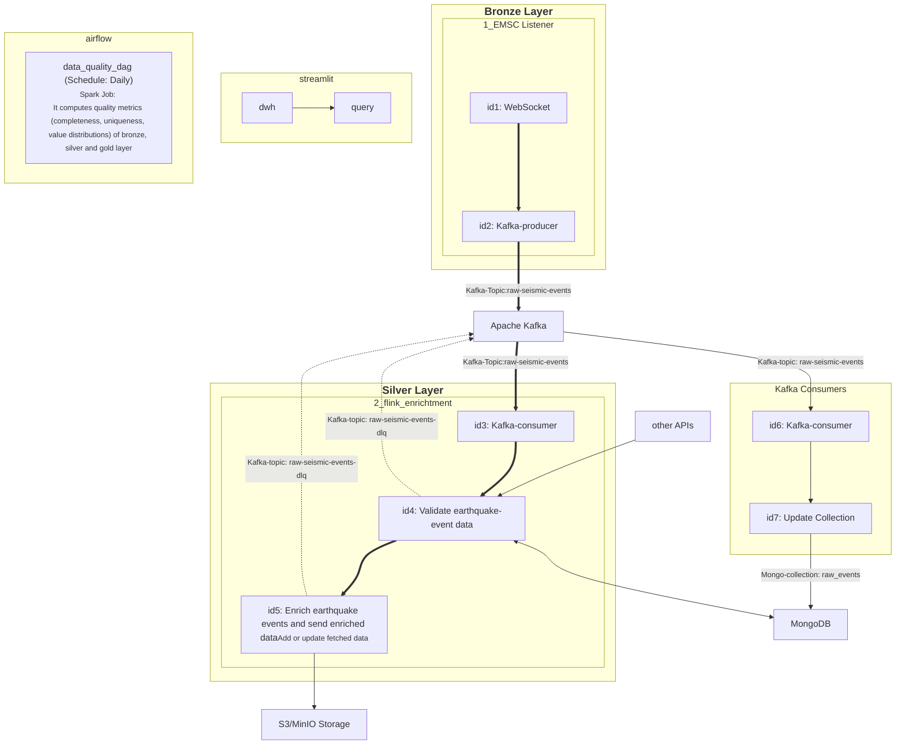

# Overview

#### Bronze Layer

The Bronze layer is the **single source of truth** for the entire pipeline. It is the
permanent, immutable archive of every seismic event exactly as it was received from
the EMSC WebSocket — no transformations, no added fields, no deletions, ever.

#### Silver Layer

The Silver layer is the **enriched, validated, quality-assured** version of every
raw seismic event. It sits between the raw Bronze archive and the business-ready Gold
aggregations. Nothing reaches Silver without passing both real-time enrichment and
per-record validation. Nothing reaches Gold without passing a dataset-level quality
check against Silver.

#### Gold Layer

The Gold layer is the **final, business-ready output** of the pipeline. It takes
every enriched Silver event and transforms it into impact scores, regional
aggregations, and daily summaries that the data warehouse and the Streamlit dashboard
can query directly.

Gold answers the question: **how serious is this event, where does it rank, and what
is the regional picture?**

Where Bronze stores raw truth and Silver stores enriched context, Gold stores
**derived insight** — computed, validated, and loaded. It is the only layer the
dashboard ever reads.

Bronze  ──  raw · immutable · permanent · source of truth
   │
   │  Flink reads and enriches
   ▼
Silver  ──  enriched · validated · quality-assured
   │
   │  PySpark aggregates and scores
   ▼
Gold    ──  aggregated · scored · business-ready
   │
   │  Loaded into DWH
   ▼
DWH     ──  query-optimized · Streamlit reads here


airflow

monitoring

monitoring-app

spark

spark-jobs





example file in S3-Bronze folder:

```json
{
    "action": "create",
    "data": {
        "type": "Feature",
        "geometry": {
            "type": "Point",
            "coordinates": [
                142.8124,
                40.515,
                -44.7
            ]
        },
        "id": "20260430_0000391",
        "properties": {
            "source_id": "1992055",
            "source_catalog": "EMSC-RTS",
            "lastupdate": "2026-05-09T10:09:52.946851Z",
            "time": "2026-04-30T08:43:19.582Z",
            "flynn_region": "NEAR EAST COAST OF HONSHU, JAPAN",
            "lat": 40.515,
            "lon": 142.8124,
            "depth": 44.7,
            "evtype": "ke",
            "auth": "NEIC",
            "mag": 4.5,
            "magtype": "mb",
            "unid": "20260430_0000391"
        }
    }
}
```

example file in S3-Silver folder:

```json
{
    "action": "update",
    "data": {
        "type": "Feature",
        "geometry": {
            "type": "Point",
            "coordinates": [
                28.9794,
                38.0572,
                -7.0
            ]
        },
        "id": "20260509_0000357",
        "properties": {
            "source_id": "1992309",
            "source_catalog": "EMSC-RTS",
            "lastupdate": "2026-05-10T00:04:32.750591Z",
            "time": "2026-05-09T22:30:43.79Z",
            "flynn_region": "WESTERN TURKEY",
            "lat": 38.0572,
            "lon": 28.9794,
            "depth": 7.0,
            "evtype": "ke",
            "auth": "EMSC",
            "mag": 1.0,
            "magtype": "ml",
            "unid": "20260509_0000357"
        }
    },
    "enriched_at": "2026-05-10T00:04:33.464708",
    "ge_validation_passed": true
}
```

example file in S3-Gold folder (daily_summary):

```json
{
    "total_events": 218,
    "max_magnitude_global": 5.3,
    "max_composite_score_global": 4.456416666666667,
    "regions_affected": 115,
    "processing_date": "2026-05-10",
    "aggregated_at": "2026-05-10T22:00:31.284Z",
    "region": "GLOBAL"
}
```

example file in S3-Gold folder (impact_score):

```json
{
    "event_id": "20260509_0000362",
    "lat": -20.6,
    "lon": -68.84,
    "magnitude": 2.7,
    "depth": 107.3,
    "event_time": "2026-05-09T23:15:58.0Z",
    "region": "TARAPACA, CHILE",
    "enriched_at": "2026-05-09T23:22:29.233779",
    "ge_validation_passed": true,
    "tsunami_risk": 0.0,
    "mmi_estimate": 3.922910000000001,
    "building_vulnerability": 3.922910000000001,
    "population_exposure": 0.0,
    "infrastructure_risk": 3.444666666666667,
    "composite_score": 1.6696608333333336,
    "processing_date": "2026-05-09",
    "scored_at": "2026-05-10T00:00:29.529Z"
}
{
    "event_id": "20260509_0000353",
    "lat": 45.4879,
    "lon": 26.2254,
    "magnitude": 3.6,
    "depth": 130.0,
    "event_time": "2026-05-09T22:50:36.9Z",
    "region": "ROMANIA",
    "enriched_at": "2026-05-09T23:21:55.005949",
    "ge_validation_passed": true,
    "tsunami_risk": 0.0,
    "mmi_estimate": 4.971,
    "building_vulnerability": 4.971,
    "population_exposure": 0.0,
    "infrastructure_risk": 4.013333333333334,
    "composite_score": 2.0454166666666667,
    "processing_date": "2026-05-09",
    "scored_at": "2026-05-10T00:00:29.529Z"
}
```

example file in S3-Gold folder (regional_stats):

```json
{
    "region": "GREATER LOS ANGELES AREA, CALIF.",
    "event_count": 2,
    "unique_events": 2,
    "avg_magnitude": 2.7,
    "max_magnitude": 3.2,
    "avg_composite_score": 2.1231495833333334,
    "max_composite_score": 2.4160375000000003,
    "avg_tsunami_risk": 0.0,
    "max_tsunami_risk": 0.0,
    "avg_population_exposure": 0.0,
    "processing_date": "2026-05-10",
    "aggregated_at": "2026-05-10T23:00:30.498Z"
}
{
    "region": "OAXACA, MEXICO",
    "event_count": 3,
    "unique_events": 3,
    "avg_magnitude": 3.466666666666667,
    "max_magnitude": 3.5,
    "avg_composite_score": 2.5326175,
    "max_composite_score": 2.5881833333333333,
    "avg_tsunami_risk": 0.0,
    "max_tsunami_risk": 0.0,
    "avg_population_exposure": 0.0,
    "processing_date": "2026-05-10",
    "aggregated_at": "2026-05-10T23:00:30.498Z"
}
```

example file in S3-Gold folder (quality_profiles/bronze_profile.json):

```json
{
  "layer": "bronze",
  "date": "2026-05-08",
  "profiled_at": "2026-05-09T10:09:11.587551+00:00",
  "row_count": 262,
  "distinct_ids": 262,
  "duplicate_count": 0,
  "null_rates": {
    "action": 0.0,
    "data": 0.0
  },
  "columns": [
    "action",
    "data"
  ]
}
```

example file in S3-Gold folder (quality_profiles/silver_profile.json):

```json
{
  "layer": "silver",
  "date": "2026-05-08",
  "profiled_at": "2026-05-09T10:09:26.876443+00:00",
  "row_count": 262,
  "distinct_ids": 262,
  "duplicate_count": 0,
  "null_rates": {
    "action": 0.0,
    "data": 0.0,
    "enriched_at": 0.0,
    "ge_validation_passed": 0.0,
    "usgs_nearby": 0.2252,
    "weather_baseline": 0.2252
  },
  "columns": [
    "action",
    "data",
    "enriched_at",
    "ge_validation_passed",
    "usgs_nearby",
    "weather_baseline"
  ]
}
```

example file in S3-Gold folder (quality_profiles/gold_profile.json):

```json
{
  "layer": "gold",
  "date": "2026-05-08",
  "profiled_at": "2026-05-09T10:14:45.840096+00:00",
  "row_count": 262,
  "distinct_ids": 262,
  "duplicate_count": 0,
  "null_rates": {
    "building_vulnerability": 0.0,
    "composite_score": 0.0,
    "depth": 0.0,
    "enriched_at": 0.0,
    "event_id": 0.0,
    "event_time": 0.0,
    "ge_validation_passed": 0.0,
    "infrastructure_risk": 0.0,
    "lat": 0.0,
    "lon": 0.0,
    "magnitude": 0.0,
    "mmi_estimate": 0.0,
    "population_exposure": 0.0,
    "processing_date": 0.0,
    "region": 0.0,
    "scored_at": 0.0,
    "tsunami_risk": 0.0,
    "usgs_max_magnitude": 0.2252,
    "usgs_nearby_count": 0.2252
  },
  "columns": [
    "building_vulnerability",
    "composite_score",
    "depth",
    "enriched_at",
    "event_id",
    "event_time",
    "ge_validation_passed",
    "infrastructure_risk",
    "lat",
    "lon",
    "magnitude",
    "mmi_estimate",
    "population_exposure",
    "processing_date",
    "region",
    "scored_at",
    "tsunami_risk",
    "usgs_max_magnitude",
    "usgs_nearby_count"
  ]
}
```


